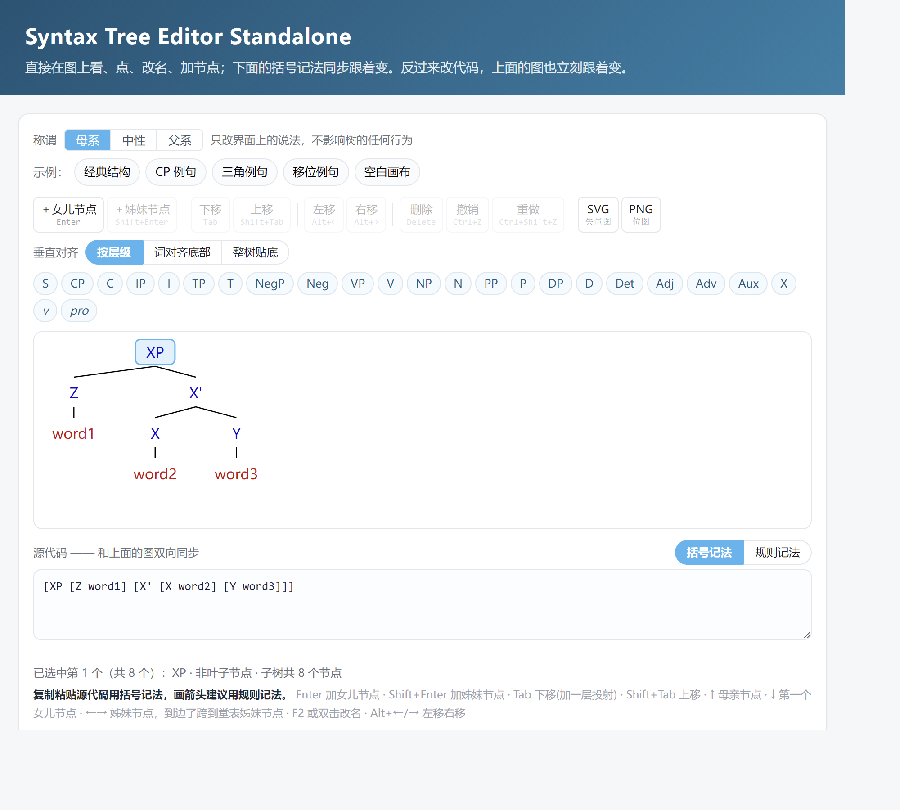
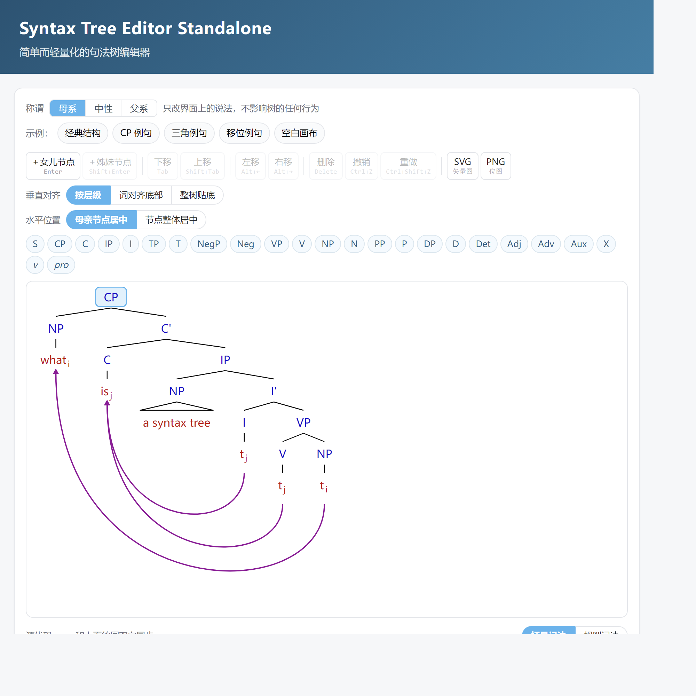
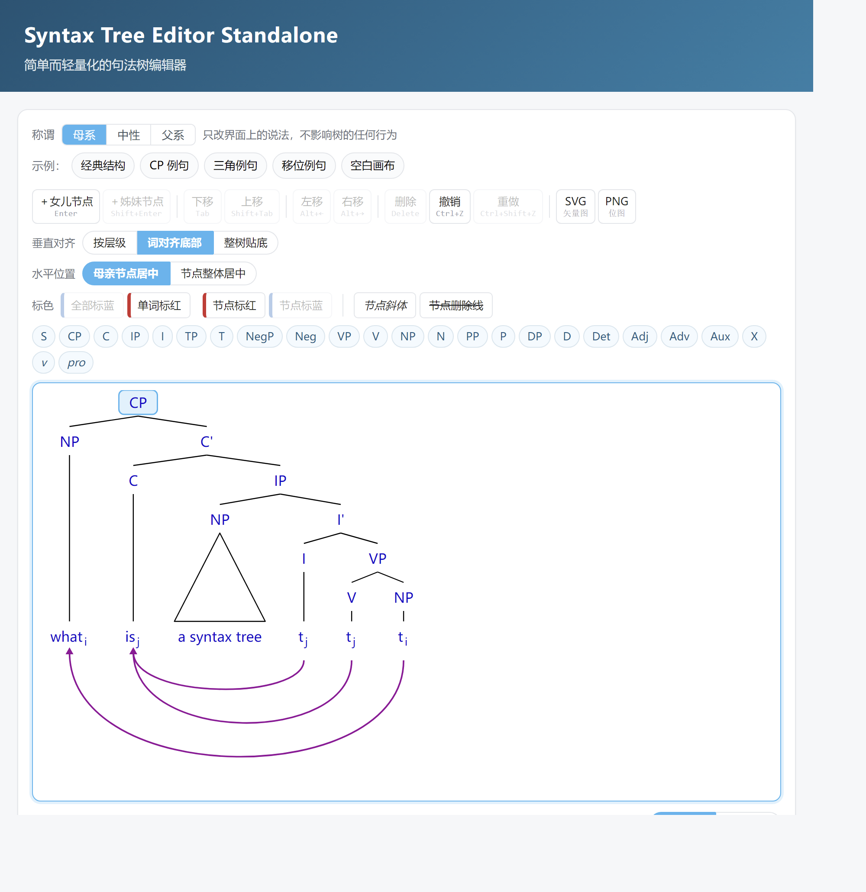
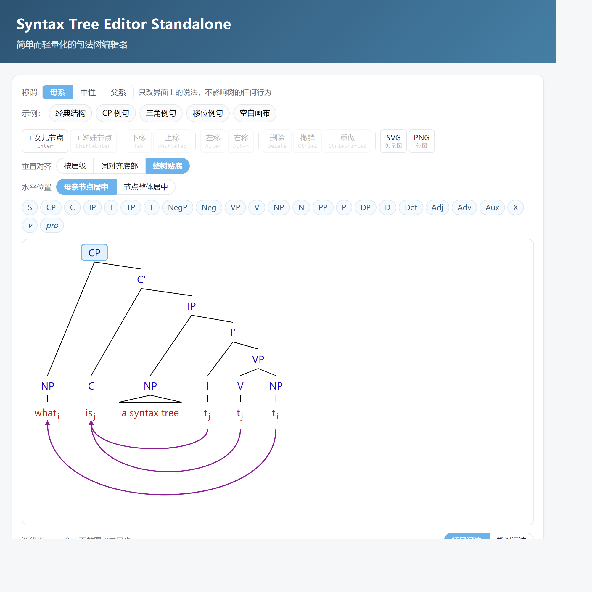
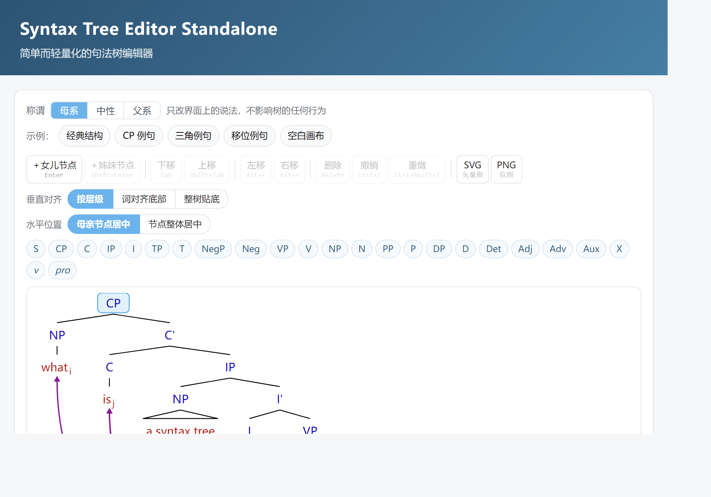

# Syntax Tree Editor Standalone

简单而轻量化的句法树编辑器，图形与代码双向同步，双击一个 HTML 文件即可使用。
A simple and lightweight syntax tree editor. Diagram and code stay in sync — just double-click one HTML file.

> 本项目由 deepseek 辅助开发。
> This project is developed with the assistance of DeepSeek.



## 这是什么 / What this is

在图上点击、改名、增删节点会同步修改代码；编辑代码，图也会立刻随之修改。
Clicking, renaming, adding or deleting nodes on the diagram updates the code accordingly; editing the code updates the diagram immediately.

整个编辑器是**一个 HTML 文件**：样式、脚本、示例图全部内联。不需要联网、不需要安装、不需要起服务器。底层是 8 个原生 ES Module，零第三方依赖。
The whole editor is **a single HTML file**: styles, scripts and example images are all inlined. No network, no installation, no server needed. Underneath are 8 plain ES Modules with zero third-party dependencies.

## 怎么用 / How to use

到 [Releases](../../releases/latest) 下载 `Syntax Tree Editor Standalone.html`，双击即可。
Download `Syntax Tree Editor Standalone.html` from [Releases](../../releases/latest) and double-click it.

## 功能 / Features

- 两套记法（括号 / 规则），双向同步，随时切换 · Two notations (bracket / rule), bidirectionally synced
- 三种垂直对齐，两种水平位置 · Three vertical alignments, two horizontal positions
- 方向键选中：↑ 母亲节点、↓ 最左女儿节点、← → 左右姊妹节点 · Arrow-key selection
- 结构操作：下移、上移、左移、右移、增删节点 · Structural edits: move down / up / left / right, add and delete
- 位移箭头、斜体 / 粗体 / 删除线 / 九种颜色，多词叶子自动画成三角 · Movement arrows, italic / bold / strikethrough / nine colours, multi-word leaves drawn as triangles
- 一键标色：全蓝、词红、单个标红、单个标蓝 · One-click colouring: all blue, words red, single node red or blue
- 导出 SVG / 两倍 PNG，完整撤销重做 · Export SVG / 2x PNG, full undo and redo

各操作的详细用法见编辑器页面底部的「使用方法」。
Detailed instructions for each operation are in the "使用方法" section at the bottom of the editor page.

## 界面 / Screenshots

| 按层级 / Depth | 词对齐底部 / Words bottom | 整树贴底 / Tree bottom |
| --- | --- | --- |
|  |  |  |

| 空白画布 / Blank canvas | 规则记法与装订线 / Rule notation and gutter |
| --- | --- |
|  |  |

## 两套记法 / The two notations

括号记法沿用语言学通行的写法，适合整棵粘贴：
Bracket notation follows the convention common in linguistics and is best for pasting a whole tree:

```
[CP [NP what_i] [C' [C is_j] [IP [NP a syntax tree] [I' [I t_j ->6] [VP [V t_j ->6] [NP t_i ->3]]]]]]]
```

规则记法为本项目设计的记录方法，每行写一条边，适合逐条核对，绘制箭头更为直观：
Rule notation is a recording method designed by this project. It writes one edge per line, which is easier to check line by line and more intuitive for drawing arrows:

```
0 XP -> D
0 XP -> X'
1 D -> w1
2 X' -> X
2 X' -> Y
4 X -> w2
5 Y -> w3
```

两套记法读写同一棵树，但**位移箭头的编号方式不同**：括号记法用**词序号**（从左到右第几个词，从 1 开始，与 jsSyntaxTree 一致），规则记法用**节点编号**（根为 0，其余按首次出现在箭头右边的那一行的行号）。样式声明两套记法都用节点编号。
Both notations read and write the same tree, but **arrows are numbered differently**: bracket notation uses **word order** (the Nth word from the left, 1-based, matching jsSyntaxTree), while rule notation uses **node numbers** (root 0, then the line on which a node first appears right of an arrow). Style declarations use node numbers in both.

## 当组件用 / Using it as a component

（尚未经过大量测试。）
(Not yet extensively tested.)

```js
import { SyntaxTreeEditor } from "./src/editor.js";

const editor = new SyntaxTreeEditor("#host", {
  value: "[S [NP Dogs] [VP barks]]",
  onChange: ({ text, rules }) => console.log(text),
});

editor.getValue();     // 括号记法 / bracket notation
editor.getRules();     // 规则记法 / rule notation
editor.addChild();     // 结构编辑 / structural edit
editor.toSvgString();  // 导出 / export
```

完整 API、两套记法的语法定义、以及「改一个功能要动哪几个文件」，见 [`AGENTS.md`](AGENTS.md)。函数级行号索引见 [`STRUCTURE.md`](STRUCTURE.md)。
The full API, the grammar of both notations and a guide to which files to touch are in [`AGENTS.md`](AGENTS.md); function-level line numbers are in [`STRUCTURE.md`](STRUCTURE.md).

## 开发 / Development

```
npm.cmd run build    重新生成单文件版 / rebuild the standalone file
npm.cmd test         四套测试 + 一致性自检 / four test suites plus the self-check
```

| 测试套件 / Test suite | 负责 / Responsibility |
| --- | --- |
| `test/smoke.mjs`（92 项） | 纯逻辑：模型、两套记法、布局、箭头，不需要浏览器<br>Pure logic: model, both notations, layout, arrows; no browser needed |
| `test/rules.test.mjs`（31 项） | 规则记法的解析、序列化、错误信息<br>Rule notation parsing, serialisation and errors |
| `test/editor.test.mjs`（143 项） | 交互层，跑在最小 DOM 垫片上<br>Interaction layer, on a minimal DOM shim |
| `test/standalone.test.mjs`（13 项） | 单文件版：模块没有遗漏、内联后可以运行<br>Standalone file: nothing missing, still runnable after inlining |

修改 `src/`、`index.html` 或 `style.css` 之后必须重新构建。`npm.cmd test` 会将磁盘上的构建产物与重新构建的结果逐字节比对，缺少重新构建将直接报错。
A rebuild is required after modifying `src/`, `index.html` or `style.css`. `npm.cmd test` compares the build output on disk with a freshly built result byte by byte, and reports an error when the rebuild is missing.

`Syntax Tree Editor Standalone.html` 为构建产物，不应手动修改。
`Syntax Tree Editor Standalone.html` is a build output and should not be edited manually.

## 文件结构 / File structure

```
Syntax Tree Editor Standalone.html   交付物，双击即用（构建产物）/ deliverable, double-click to run (build output)
index.html                           编辑器页面与使用方法 / editor page and instructions
style.css                            全部样式 / all styles
package.json                         build / test / serve
AGENTS.md                            给 AI agent 的项目说明 / project notes for AI agents
STRUCTURE.md                         函数级行号索引 / function-level line index
src/model.js                         数据模型与结构操作，不依赖 DOM / data model and tree ops, DOM-free
src/notation.js                      括号记法 ↔ 模型 / bracket notation to model
src/rules.js                         规则记法 ↔ 模型 / rule notation to model
src/style.js                         斜体 / 粗体 / 删除线 / 颜色声明 / italic, bold, strikethrough and colour declarations
src/layout.js                        布局与对齐，不依赖 DOM / layout and alignment, DOM-free
src/render.js                        渲染为可交互 SVG / renders an interactive SVG
src/editor.js                        核心组件 SyntaxTreeEditor / the core component
src/main.js                          演示页引导 / demo page bootstrap
test/smoke.mjs                       纯逻辑测试 / pure logic tests
test/rules.test.mjs                  规则记法测试 / rule notation tests
test/editor.test.mjs                 交互层测试 / interaction layer tests
test/standalone.test.mjs             构建产物测试 / build output tests
test/dom-shim.mjs                    最小 DOM 垫片 / minimal DOM shim
tools/build-standalone.mjs           内联成单文件版 / inlines the modules
tools/check-project.mjs              一致性自检 / consistency self-check
tools/gen-examples.mjs               生成示例图 / generates the example images
tools/gen-structure.mjs              生成 STRUCTURE.md / generates STRUCTURE.md
docs/                                截图 / screenshots
example/                             示例图，构建时内联 / example images, inlined at build time
```

## 已知限制 / Known limitations

- 图上不能直接画箭头，只能在代码面板写声明 · Arrows must be declared in the code panel, not drawn on the diagram
- 不能拖拽节点 · Nodes cannot be dragged
- 标签里不能有双引号，记法没有转义写法 · Labels cannot contain double quotes; no escape syntax
- 规则记法至少要有一条边，孤立节点在规则记法里是空的 · Rule notation needs at least one edge; a lone node is empty in it
- 尚不支持英文界面，将在后续版本中开发 · An English interface is not yet supported; it is planned for a future release

## 许可证 / License

以 **MIT 许可证**发布，全文见 [`LICENSE`](LICENSE)。可自由使用、修改、再分发，包括商用，只需保留版权声明；软件按原样提供，不附带任何担保。
Released under the **MIT License**, see [`LICENSE`](LICENSE). Free to use, modify and redistribute, including commercially, as long as the copyright notice is kept; provided as is, without warranty of any kind.

输入格式沿用 phpSyntaxTree / jsSyntaxTree 通行的括号记法。本项目为独立实现，未使用其源码。
The input format follows the bracket notation common to phpSyntaxTree / jsSyntaxTree. This is an independent implementation and uses none of their source code.